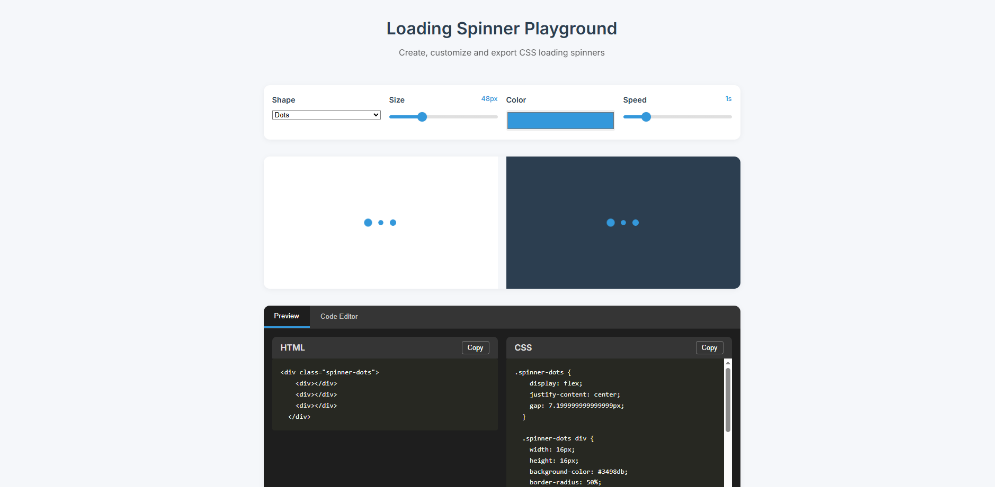

# Loading Spinner Demo

A simple project demonstrating how to create a custom loading spinner with HTML, CSS, and JavaScript. Includes CodeMirror integration for live previews.



## ✨ Features

- Custom animated loading spinner
- Responsive design
- CodeMirror-based code editor and live preview
- Tab switching between "Editor" and "Preview"

## 🚀 Live Demo

[View on GitHub Pages](https://teodoriliev06.github.io/loading-spinners-playground/)

## 📦 Tech Stack

- HTML
- CSS
- JavaScript
- CodeMirror

## 📁 How to Run Locally

```bash
git clone https://github.com/TeodorIliev06/loading-spinners-playground.git
cd spinner-project
open index.html
